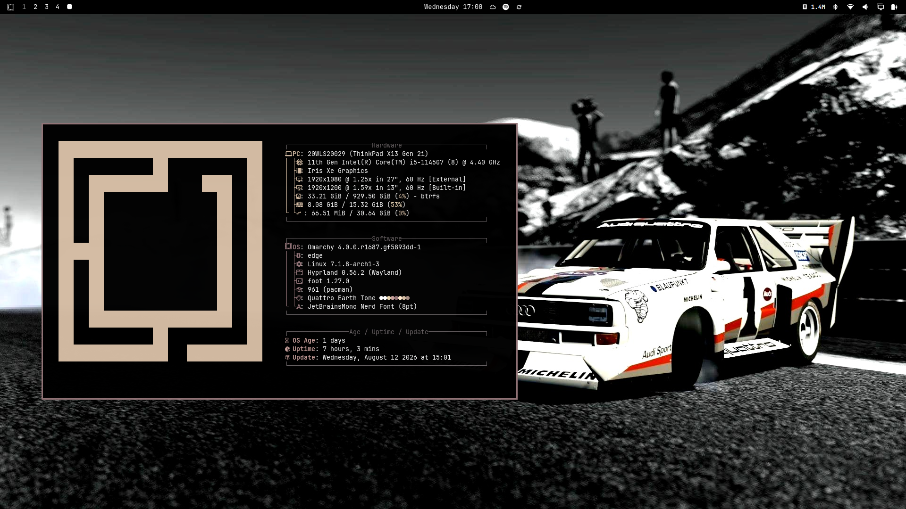
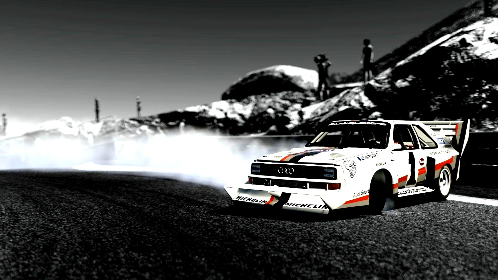
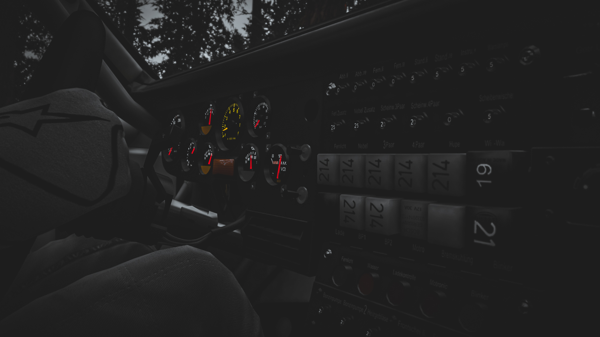
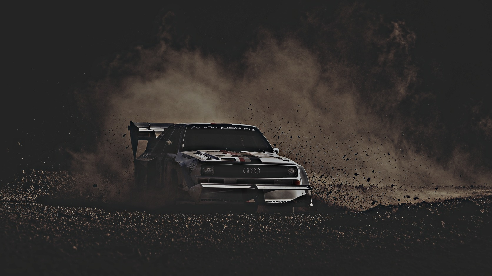

# omarchy-quattro-earth-tone-theme



An Omarchy theme based on the Audi Sport quattro rally livery, reimagined in warm earth tones: deep black soil as background, cream sand as foreground, with accents in clay, terracotta, warm brass and cocoa brown.

## Installation

```bash
omarchy theme install https://github.com/jesseburlamaque/omarchy-quattro-earth-tone-theme
```

## Wallpapers

Included wallpapers for the theme. Click a thumbnail to open in full resolution.

### Quattro Earth Tone 1



### Quattro Earth Tone 2



### Quattro Earth Tone 3



## Colors

| Role | Color |
|---|---|
| Background | `#000000` |
| Foreground | `#FFFFFF` |
| Accent | `#d4a37e` |
| Red | `#a78c83` |
| Green | `#d3bba2` |
| Yellow | `#ffe7cc` |
| Blue | `#d4a37e` |
| Magenta | `#c69e9a` |
| Cyan | `#e9d4ae` |
| Brown | `#6c5e5a` |

## Icon theme

Folder icons use `Yaru-wartybrown` for that earthy folder look.

## License

MIT License — see [LICENSE](LICENSE).
